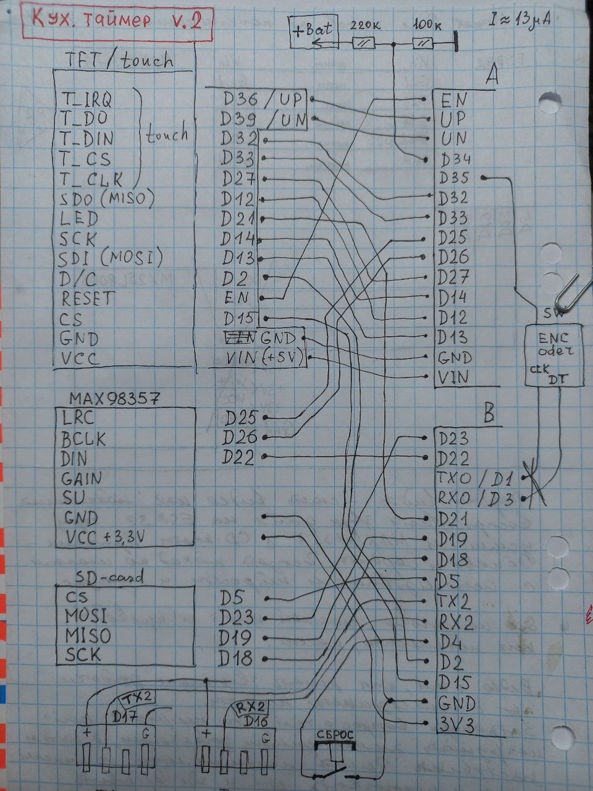

# Кухонный таймер + пищевой термометр + духовка.

- Незаменимое устройство для кухни, контролирующее время и температуру готовки. Можно не следить за молоком на плите, не ждать закипания и не контролировать время готовки одновременно у нескольких блюд.

## Возможности

- Гибкая установка времени таймеров с градацией в 1 минуту.
- Гибкая установка температуры срабатывания с градацией в 1 градус, от ноля до 100 градусов.
- Три независимых таймера.
- Два пищевых термометра.
- Термометр духовки.
- Сенсорный экран.
- 650 строк кода на си-ардуино.
- 8 напечатанных на 3д-принтере деталей.
- Одновременная работа всех шести датчиков независимо друг от друга.
- Аккумуляторное питание.
- Индикатор заряда аккумулятора.
- Зарядка от 5-вольтового зарядника для телефонов или от USB.
- Отдельная кнопка ввода фиксированного времени в одно нажатие, с точностью до секунды.
- Громкое звуковое оповещение.
- Звуковой файл на микроSD - можно записать любую мелодию

## Фото устройства

  
*Собранное устройство.*
  
*Что внутри.*

## Электрическая схема

  
*Полная электрическая схема*

Подробные файлы схемы:  
- (в планах) ~~[KiCad проект → schematic.kicad_sch](hardware/schematics/)~~
- (в планах) ~~[Экспорт в PDF → schematic.pdf](hardware/schematics/schematic.pdf)~~

## Как открыть и собрать проект

1. Для прошивки микроконтроллера используется Arduino, файл KitchenTimer_v2.ino (файл копируй вместе с папкой, т.к. ардуино требует одноименных названий того и другого). Перед прошивкой обрати внимание на имя файла звука, которое должно быть на флешке. Если файл не найден - сутройство не покажет экран.
2. Детали кормушки напечатаны на 3д принтере, STL-модели находятся в папке 3Dmodels. ВАЖНО!!! Поскольку это был первый экземпляр, то без мелких ошибок не обошлось, и могут появитсья вопросы. В будущем если проект вызовет интерес, планирую переработать модели, чтобы сборка происходила без лишних телодвижений. В данной версии потребуется не только склейка но и подрезка. "Лицо" задумано из четырех частей, так как напечатать его на принтере целиком крайне не выгодно по филаменту. Проще склеить. Я печатал PETG, он не воняет и легко склеивается дихлорметаном.
3. Радиоэлектронные компоненты: ESP32, картридер микроSD, цифровой усилитель MAX98357, BMS на один аккумулятор с USB разъемом. Термометры - пищевые в оболочке с проводом (внутри 18B20), распаяны на usb-разъем. Все куплено на алиэкспресс.

## Как использовать

1. Кнопка сверху - только лишь выключает звук, таймеры не сбрасываются. Чтобы сбросить любой таймер просто вычитай из него кнопкой до нуля.
2. Всё управление с сенсорного экрана. Логика: выбрал плашку таймера или термометра, она обведется светлозеленым. При включении обведена плашка 1-го таймера. Далее нажимая кнопки с плюс и минус меняешь значение таймера, в любой момент его работы. Таймер тикает сразу.
3. Плашки термометров - правые. На плашке слева - температура полключенного термометра, через дефис справа - температура сигнализации, по умолчанию 95 гардусов - т.е. незадолго до закипания. Если при выбранной плашке температуры нажимать кнопки плюс-минус - будет меняться температура сигнализации.
4. Кнопка с чашечкой - выставляет таймер №3 на 8 минут 20 секунд - время заваривания чая. В коде можешь выставить любое другое время под свои нужды. Это кнопка в 1 клик.
5. Sbros на экране дублирует сброс сверху. НА его место планируется температру в духовке.
6. Кнопка очистки таймеров так же в планах.

## Зависимости / Требования

Для прошивки под линукс открываем терминал, вводим команду *sudo chmod a+rw /dev/ttyACM0* либо *sudo chmod a+rw /dev/ttyUSB0*, чтобы система получила доступ к устройству, то есть задать права доступа. Теперь можно прошивать из ардуино. Как это делается в Windows - расскажите, добавлю сюда. Предполагаю, что понадобится установка драйверов и другие танцы с бубном.

## Disclaimer

Это первая версия readme, в ней обязательно должны быть ошибки и недочеты, по этому обращайтесь по контактам ниже, с вашей помощью устраним баги для будущих посетителей.

Это рабочий отлаженный прототип. Но пердполагается апгрейд проекта (кнопки интерфейса и термометр духовки и др.)
Используй на свой страх и риск.  

Сообщения об ошибках / PR приветствуются!

## Лицензия

MIT License — см. файл [LICENSE](LICENSE)

## Контакты

Если хотите со мной связаться: телега *@kahsuist*
